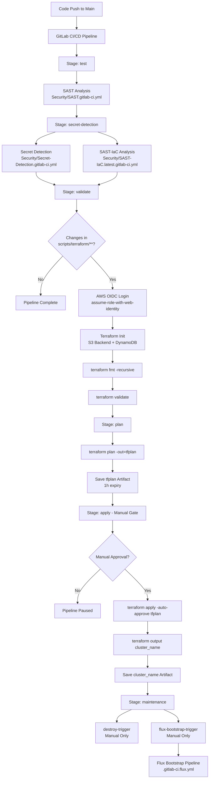

# Infrastructure Workflows

## GitLab CI/CD Workflow



## GitOps Workflow with FluxCD

```mermaid
flowchart TD
    A[flux-bootstrap-trigger] --> B[AWS OIDC + EKS Setup]
    B --> C[flux bootstrap gitlab<br/>--path=clusters/default]
    
    C --> D[Flux Controllers Deployed]
    D --> E[Source Controller<br/>Git Repository Monitoring]
    
    E --> F[Kustomize Controller<br/>Manifest Processing]
    F --> G[Helm Controller<br/>Chart Processing]
    
    G --> H[Stage 1: infra-namespaces]
    H --> I[Create Namespaces:<br/>cert-manager, eso, hashicorp,<br/>ingress-nginx, monitoring,<br/>production, security]
    
    I --> J[Stage 2: infra-network]
    J --> K[Deploy Cilium CNI<br/>infrastructure/network/base]
    K --> L[Apply Network Configs<br/>infrastructure/network/config]
    L --> M[Deploy Network Policies<br/>infrastructure/network/policies]
    
    M --> N[Stage 3: infra-repositories]
    N --> O[Add Helm Repositories:<br/>cert-manager, cilium, eso,<br/>hashicorp, ingress-nginx,<br/>weave-dashboard]
    
    O --> P[Stage 4: infra-controllers]
    P --> Q[Deploy cert-manager<br/>TLS Certificate Management]
    P --> R[Deploy external-secrets<br/>ESO Controller]
    P --> S[Deploy hashicorp-vault<br/>Secret Management]
    P --> T[Deploy ingress-nginx<br/>Load Balancer]
    P --> U[Deploy weave-dashboard<br/>GitOps UI]
    
    Q --> V[Stage 5: infra-configs]
    R --> V
    S --> V
    T --> V
    U --> V
    
    V --> W[Apply Configurations:<br/>automation-config,<br/>cert-manager-config,<br/>vault-config]
    
    W --> X[Stage 6: monitoring]
    X --> Y[Deploy kube-prometheus-stack<br/>Prometheus + Grafana]
    X --> Z[Deploy loki-stack<br/>Log Aggregation]
    X --> AA[Apply PodMonitors<br/>& Dashboards]
    
    Y --> BB[Stage 7: apps]
    Z --> BB
    AA --> BB
    
    BB --> CC[Deploy apps/namespaces<br/>demo-namespace]
    CC --> DD[Apply Network Policies<br/>allow-linksphere-postgres-policy]
    DD --> EE[Deploy Applications:<br/>linksphere (Helm),<br/>postgres]
    
    EE --> FF[Health Checks &<br/>Continuous Reconciliation]
    FF --> GG{Configuration Drift?}
    
    GG -->|Yes| HH[Auto-Reconciliation<br/>Git Source of Truth]
    GG -->|No| II[Healthy State<br/>Continue Monitoring]
    
    HH --> F
    II --> FF
    
    subgraph "External Secrets Flow"
        R --> JJ[ESO Watches Vault]
        S --> KK[Vault Stores Secrets]
        JJ --> LL[Creates K8s Secrets]
        KK --> JJ
    end
    
    subgraph "Network Security"
        K --> MM[Pod-to-Pod Encryption]
        L --> NN[Cilium Network Policies]
        M --> OO[Traffic Flow Control]
    end
```